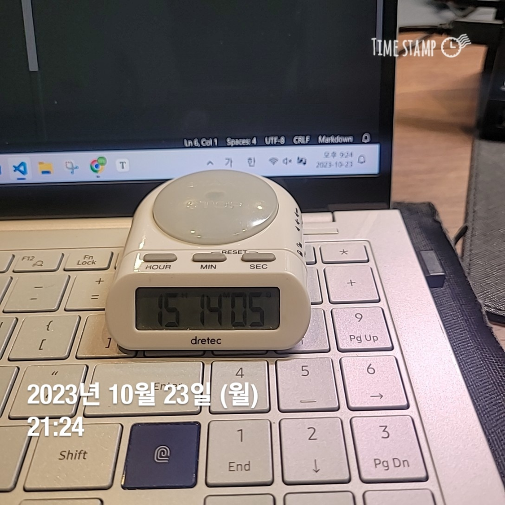

## 2023-10-23 21:24 Mon
- 스프링 기본 원리
  - 스프링 섹션3 마지막 한 개 강의 남은 상황
- 자바의 정석
  - 1장부터 5장 배열까지 복습 완료

- 보낸 시간에 비해 오늘 한 게 학습량이 저조함. 좀 더 세분화해서 학습을 어떻게 진행하고 있는지 정리할 필요가 있음. 이대로는 너무 학습 효율이 비효율적!
- 객체지향의 사실과 오해는 자바의 정석 다형성 끝나면 볼 예정
- 코딩테스트는 객체지향의 사실과 오해 + 자바의 정석 모두 다 끝나고 준비
- 스프링 강의는 매일 최소! 3~4시간씩 들을 예정